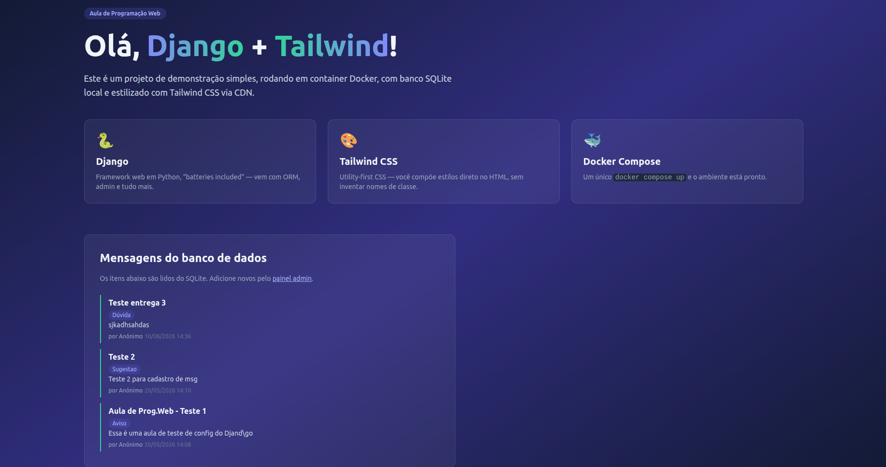

# Demo Django + Tailwind 🚀


Um projeto prático desenvolvido para a **Aula de Programação Web**, focado em integrar o framework Django com o poder de estilização utilitária do Tailwind CSS, rodando em um ambiente conteinerizado.

---

## 📌 Sobre o Projeto

Este é um projeto de demonstração simples que tem como objetivo aplicar conceitos de backend com **Django** (ORM, rotas, views, templates) e de frontend utilizando **Tailwind CSS** (via CDN). A aplicação simula um mural de mensagens, onde os dados são consumidos de um banco de dados **SQLite** local. Tudo isso envelopado e facilitado pelo **Docker Compose**.

### ✨ Funcionalidades

- **Mural de Mensagens:** Lista mensagens salvas no banco de dados.
- **Painel Administrativo (`/admin`):** Interface nativa do Django para gerenciar as mensagens (Criar, Editar, Excluir).
- **Páginas Adicionais:** Rotas extras como `/sobre` e `/tema`.
- **Alternador de Tema:** Suporte a tema claro e escuro salvando as preferências no `localStorage`.
- **Design Responsivo & Moderno:** Interface polida utilizando classes utilitárias do Tailwind CSS.

---

## 🛠️ Tecnologias Utilizadas

- **Backend:** [Python 3](https://www.python.org/) + [Django 5.1](https://www.djangoproject.com/)
- **Frontend:** HTML5, JavaScript (Vanilla) e [Tailwind CSS](https://tailwindcss.com/)
- **Banco de Dados:** SQLite (padrão do Django)
- **Infraestrutura:** Docker e Docker Compose

---

## 🚀 Como Executar o Projeto

Você pode rodar este projeto de duas maneiras: utilizando Docker (Recomendado) ou localmente em sua máquina.

### Opção 1: Usando Docker (Recomendado) 🐳

**Pré-requisitos:** Ter o [Docker](https://www.docker.com/) e o [Docker Compose](https://docs.docker.com/compose/) instalados na sua máquina.

1. Clone o repositório ou navegue até a pasta do projeto:
   ```bash
   cd demo-django
   ```

2. Suba os containers com o Docker Compose:
   ```bash
   docker compose up -d --build
   ```

3. Acesse a aplicação no seu navegador:
   - **Página Inicial:** [http://localhost:8000](http://localhost:8000)
   - **Painel Admin:** [http://localhost:8000/admin](http://localhost:8000/admin) *(Crie um superusuário primeiro, se necessário)*

**Dica:** O comando `migrate` já é executado automaticamente na inicialização do container!

### Opção 2: Rodando Localmente (Sem Docker) 🐍

**Pré-requisitos:** Ter o [Python 3](https://www.python.org/downloads/) instalado.

1. Navegue até o diretório do projeto:
   ```bash
   cd demo-django
   ```

2. Crie e ative um ambiente virtual (opcional, mas recomendado):
   ```bash
   python -m venv venv
   source venv/bin/activate  # Linux/macOS
   # ou
   venv\Scripts\activate     # Windows
   ```

3. Instale as dependências:
   ```bash
   pip install -r requirements.txt
   ```

4. Aplique as migrações no banco de dados:
   ```bash
   python manage.py migrate
   ```

5. (Opcional) Crie um superusuário para acessar o painel admin:
   ```bash
   python manage.py createsuperuser
   ```

6. Inicie o servidor de desenvolvimento:
   ```bash
   python manage.py runserver
   ```

7. Acesse no navegador em `http://localhost:8000`.

---

## 📁 Estrutura do Projeto

```text
demo-django/
├── core/                   # Configurações globais do projeto Django (settings, urls principais)
├── home/                   # App principal (models, views, urls específicas)
├── templates/              # Arquivos HTML (index, sobre, tema)
├── Dockerfile              # Instruções para construir a imagem Docker
├── docker-compose.yml      # Orquestração dos containers
├── manage.py               # Utilitário de linha de comando do Django
├── requirements.txt        # Dependências do Python (Django)
└── db.sqlite3              # Arquivo do banco de dados (gerado automaticamente)
```

---

## 📸 Screenshots

<div align="center">
  
  
  
  
</div>

## Página com as tags


